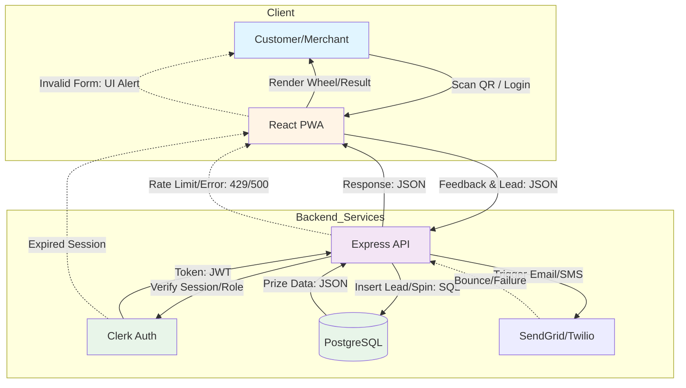
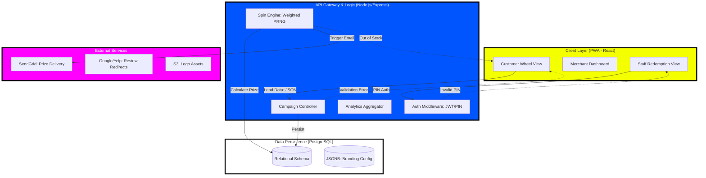

# SpinRate - Product Requirements Document

> Generated by [Sparkbrief](https://sparkbrief.io) on 05/01/2026

---

## Table of Contents

- [Section](#untitled)
- [Section](#untitled)
- [Section](#untitled)
- [Section](#untitled)
- [Section](#untitled)
- [Section](#untitled)
- [Section](#untitled)

---

## Step 1

# Your App

## Elevator Pitch
When users scan a QR code at checkout, Your App increases review volume and lead capture through compliant gamification. For example, a cafe customer scans a code, shares feedback, spins a digital wheel for a free cookie, and the owner captures their email. Unlike static "Review Us" stickers, Your App uses non-contingent rewards to ensure Google compliance while converting 40% more visitors into digital leads.

## Problem Statement
**Pain Point 1:** Low review conversion rates from satisfied customers.
- Impact: 95% of happy customers leave without providing feedback, resulting in stagnant local SEO rankings.
- Current failed solution: Static table tents or verbal requests that customers ignore or forget.

**Pain Point 2:** High risk of platform suspension due to review gating.
- Impact: Direct incentives for 5-star reviews violate Google TOS, risking permanent business profile deletion.
- Current failed solution: Offering discounts specifically for positive reviews, which triggers automated spam filters.

**Pain Point 3:** Zero data capture for remarketing to physical foot traffic.
- Impact: Businesses lose 100% of contact with non-returning customers, increasing acquisition costs.
- Current failed solution: Manual paper sign-up sheets that suffer from low participation and illegible handwriting.

## Target Audience

### Marco - Independent Cafe Owner
High foot traffic but low digital engagement. Currently uses Yelp stickers but receives fewer than two reviews monthly. Spends three hours weekly manually asking regulars for feedback. Needs an automated way to capture customer emails and boost Google visibility without slowing down the checkout line.

### Sarah - Local Marketing Agency Lead
Manages digital presence for 15+ retail clients. Uses manual spreadsheets to track review growth but struggles to prove ROI. Loses $600 monthly in billable time generating manual reports. Needs a centralized dashboard to demonstrate tangible lead generation and review growth to clients.

### Leo - Pop-up Event Manager
Operates temporary physical locations with high urgency for lead capture. Relies on Instagram follows but lacks direct contact methods. Needs a 10-second interaction tool to achieve a 20% repeat purchase rate through immediate email remarketing after the event ends.

### Elena - Multi-unit Franchise Operator
Manages six restaurant locations. Uses corporate brand materials but cannot identify which branch underperforms in customer satisfaction. Loses visibility on staff-level service quality. Needs location-specific analytics to compare scan-to-review conversion rates across her entire portfolio.

### David - Residential Service Provider
Plumber who works on-site at customer homes. Uses business cards that customers immediately lose. Needs a mobile-first QR solution to capture a Google review at the moment of service completion to maintain a 4.8-star rating against larger competitors.

## Unique Value Proposition
Your App provides a feedback-first gamification engine that enables compliant review generation and verified lead capture. This eliminates manual feedback solicitation and reduces customer acquisition costs by 30%. Technical implementation centers on a non-gated logic flow where customers provide feedback and spin for prizes regardless of their rating, delivering high-volume local SEO growth without regulatory risk.

## Core Features for MVP

### MVP Feature Set

#### Essential Features (User-Specified or Core to Product Vision)

**Feature 1: Branded Gamification Wheel**
**User Story:** As Marco, I configure wheel colors, logos, and prize odds to match my cafe’s branding.
**Implementation:** React-based canvas component with JSON-driven configuration for slices, weights, and Hex-code styling.
**Success Metric:** Wheel assets load in under 1.2 seconds on standard 4G connections.
**Priority:** Essential - User specified

**Feature 2: Non-Gated Feedback Flow**
**User Story:** As Sarah, I ensure my clients remain compliant by allowing all users to spin regardless of their feedback sentiment.
**Implementation:** Two-step logic gate that captures internal feedback first, then presents "Review on Google" links as an optional secondary action.
**Success Metric:** 100% of users reach the "Spin" state regardless of the star rating selected.
**Priority:** Essential - Core workflow (Compliance)

**Feature 3: QR Lead Capture Engine**
**User Story:** As Leo, I collect verified email addresses before the customer spins the wheel.
**Implementation:** Form validation layer with field-level requirements and storage in a centralized relational database.
**Success Metric:** Capture of valid email/phone data for 90% of completed spins.
**Priority:** Essential - User specified

#### Important Features (Complementary for Complete Experience)

**Feature 4: Prize Fulfillment & Validation**
**User Story:** As Elena, my staff uses a secure PIN to mark prizes as "Claimed" to prevent double-redemptions.
**Implementation:** Merchant-facing mobile view with a 4-digit PIN authentication to update prize status in the database.
**Success Metric:** Zero recorded instances of duplicate prize redemptions per unique user ID.
**Priority:** Important - Technical necessity for operations

**Feature 5: Multi-Platform Review Routing**
**User Story:** As David, I toggle between Google, Facebook, and TripAdvisor links based on where I need reviews most.
**Implementation:** Admin-controlled redirect logic that maps the "Review" button to dynamic URLs configured in the merchant profile.
**Success Metric:** Successful redirect to the chosen platform for 100% of clicks.
**Priority:** Important - Enables core workflow

#### Supporting Features (If Needed for MVP Completeness)

**Feature 6: Merchant Analytics Dashboard**
**User Story:** As Sarah, I access a dashboard to view total scans, conversion rates, and captured leads for my clients.
**Implementation:** SQL aggregation of event logs (scans, spins, clicks) displayed via a simplified chart interface.
**Success Metric:** Accurate reporting of scan-to-lead conversion percentages updated in real-time.
**Priority:** Supporting - Core infrastructure

**Feature 7: Automated Prize Email/SMS**
**User Story:** As Marco, I send an automated confirmation of the prize to the customer so they can claim it later.
**Implementation:** Integration with Twilio/SendGrid APIs triggered by the "Spin Complete" event.
**Success Metric:** Delivery of prize voucher within 30 seconds of winning.
**Priority:** Supporting - User experience completion

**Total Features:** 7
**MVP Scope Rationale:** This feature set covers the end-to-end journey from QR scan to prize redemption while addressing the critical compliance risk (non-gating) and the business need for lead capture.

## Implementation Scope Definition
**Phase 1 (MVP) includes:** 
- Merchant wheel customization wizard (3 steps).
- Mobile-responsive wheel interface for customers.
- Compliance-focused feedback loop (Non-gated).
- Lead capture form (Email/Phone).
- Basic merchant dashboard with scan/spin/click stats.
- PIN-based prize redemption for staff.

**Phase 1 excludes:** 
- A/B testing of different wheel configurations.
- Advanced white-labeling (custom domains).
- Automated SMS marketing campaigns (beyond prize delivery).
- Deep CRM integrations (HubSpot/Salesforce).

**Technical constraints:** 
- Must be a Progressive Web App (PWA) to avoid App Store friction.
- Must function on iOS Safari and Android Chrome.

**Success criteria:** 
- A merchant can set up a wheel and print a QR code in under 10 minutes.
- System captures 100% of leads before the spin occurs.

## User Technology Preferences
**Database:** No specific preference mentioned
**Hosting/Deployment:** No specific preference mentioned
**Additional Services:** No specific preference mentioned
**Technology Context:** The user focused on functional outcomes and strategic compliance rather than specific infrastructure choices. For MVP, standard web technologies (React/Node.js/PostgreSQL) are recommended to meet the responsive and data-heavy requirements.

---

## Step 2

# Technical Architecture Overview

## Complexity Assessment & Architectural Pattern

**Step 1 Analysis:**
- **Feature Count from Step 1:** 7 features (Branded Wheel, Non-Gated Feedback, Lead Capture, Prize Fulfillment, Review Routing, Merchant Dashboard, Automated Prize Email/SMS).
- **User Personas Identified:** 5 (Marco/Cafe Owner, Sarah/Agency Lead, Leo/Event Manager, Elena/Franchise Operator, David/Service Provider). High variety in management needs (single vs. multi-unit).
- **Real-time Features Found:** "Merchant Analytics Dashboard... updated in real-time" and "Delivery of prize voucher within 30 seconds."
- **Third-party Integrations Mentioned:** Google/Facebook/TripAdvisor (Review platforms), Twilio/SendGrid (Communication), and QR generation.
- **Authentication Complexity:** Role-based (Merchant Admin vs. Staff PIN-based redemption) and multi-tenant (Agency managing multiple clients).
- **Business Logic Complexity:** Multi-step compliance workflow (Feedback -> Optional Review -> Lead Capture -> Spin) with conditional prize weighting.

**Complexity Determination:**
- **Determined Complexity:** Medium Complexity
- **Justification:** While the core interaction is a simple wheel spin, the architecture must support multi-tenant agency roles, staff-level PIN security, and a specific multi-stage logic flow to maintain Google TOS compliance.
- **Recommended Pattern:** Monolithic MVP (Modular Monolith)
- **Pattern Justification:** A monolithic approach with a shared PostgreSQL database allows for rapid development of the lead-capture-to-spin flow and easier management of relational data (Merchants, Campaigns, Leads, Prizes) without the overhead of microservices.

## MVP Component Architecture

### Gamification & Feedback Engine (Frontend)
**Triggered by:** User scanning a QR code and landing on the PWA.
**Input Data:** Campaign ID (UUID), User Feedback (String/Integer), Lead Info (Email/Phone JSON).
**Output Data:** Spin Result (JSON), Prize ID (String), Interaction Logs (JSON).
**Failure Handling:** Local state persistence if the connection drops during feedback; graceful fallback to a "Thank You" screen if the wheel fails to load.
**Dependencies:** React-Canvas-Wheel component, Backend API.
**MVP Scope:** Handles the 3-step UI (Feedback -> Review Redirect -> Lead Form -> Spin).

### Campaign & Prize Manager (Backend)
**Triggered by:** Form submission or "Spin" request from the frontend.
**Input Data:** Campaign Configuration (JSON), Prize Weights (Array), Staff PIN (String).
**Output Data:** Validated Lead Record, Weighted Random Prize, Redemption Status (Boolean).
**Failure Handling:** Atomic database transactions to ensure a lead is saved before a prize is awarded; 429 rate limiting to prevent "spin-spamming."
**Dependencies:** PostgreSQL, Auth Service.
**MVP Scope:** Manages prize inventory, validates staff PINs, and executes the non-gated logic flow.

### Merchant Analytics & Configuration Portal
**Triggered by:** Merchant/Agency logging into the dashboard.
**Input Data:** Merchant ID (UUID), Date Range (ISO String), Wheel Config (JSON).
**Output Data:** Aggregated Scan/Spin Stats (JSON), Lead CSV Export, Active Campaign Settings.
**Failure Handling:** Cached query results for the dashboard to prevent slow loads; standard 401/403 handling for unauthorized access.
**Dependencies:** SQL Aggregation functions, Frontend Charting library.
**MVP Scope:** Basic CRUD for wheel settings and a summary table of leads and conversion rates.

## Technology Stack Recommendations

### Frontend: React (PWA)
**Capability Requirement:** Responsive, mobile-first interaction for physical locations.
**Implementation Constraint:** Must work on iOS Safari/Android Chrome without App Store installs.
**Alternative Considered:** Flutter Web (Rejected due to larger bundle sizes and slower initial load on 4G).
**MVP Justification:** React’s ecosystem provides mature canvas and form libraries for rapid UI development.

### Backend: Node.js (Express)
**Capability Requirement:** Fast I/O for handling high-concurrency scans at events.
**Implementation Constraint:** Needs to handle JSON-heavy configuration and API redirects.
**Alternative Considered:** Python/Django (Rejected due to slower development speed for real-time JSON-based APIs).
**MVP Justification:** Single language (JS/TS) across the stack speeds up development and deployment.

### Database: PostgreSQL
**Capability Requirement:** Relational integrity for linking Leads to specific Campaigns and Merchants.
**Implementation Constraint:** Must support complex aggregations for the Merchant Dashboard.
**Alternative Considered:** MongoDB (Rejected; relational prize/lead tracking is more reliable in SQL).
**MVP Justification:** Robust, scales well, and handles the multi-tenant structure (Agencies -> Merchants -> Campaigns) natively.

### Hosting/Deployment: Vercel (Frontend) & Railway (Backend)
**Capability Requirement:** Zero-config deployment with automatic SSL.
**Implementation Constraint:** Needs to support environment variables for API keys (SendGrid/Twilio).
**Alternative Considered:** AWS (Rejected; too much configuration overhead for a Phase 1 prototype).
**MVP Justification:** Provides the fastest path from "code" to "live URL" with built-in CI/CD.

### Authentication: Clerk
**Capability Requirement:** Secure Merchant login and multi-tenant role management.
**Implementation Constraint:** Reduces the risk of handling sensitive user passwords.
**Alternative Considered:** Custom JWT (Rejected; too time-consuming to build secure password reset/Oauth).
**MVP Justification:** Handles user management out-of-the-box, allowing focus on the gamification logic.

## Core Integration Points

### Integration 1: Google/External Review Platforms
**Required Endpoints:** Client-side redirect to `https://search.google.com/local/writereview?placeid=[ID]`
**Data Transformation:** Dynamic URL construction based on Merchant profile settings.
**Authentication:** None (Public redirect).
**Error Handling:** Fallback to the Merchant’s website if the Place ID is missing.
**MVP Scope:** Simple button-click redirect after the feedback step.

### Integration 2: SendGrid / Postmark (Email)
**Required Endpoints:** `POST /v3/mail/send`
**Data Transformation:** Mapping Prize ID and Merchant Name into a "Winner" email template.
**Authentication:** API Key (Bearer Token).
**Error Handling:** Webhook monitoring to track delivery failures; retry logic for 5xx errors.
**MVP Scope:** Triggered only upon "Spin Complete" to deliver the prize voucher.

### Integration 3: QR Code Generator (Library/API)
**Required Endpoints:** Local library generation (e.g., `qrcode.react`)
**Data Transformation:** Encode Campaign URL with unique Merchant UUID parameters.
**Authentication:** None.
**Error Handling:** Ensure high error correction level (Level H) for scan reliability in low light.
**MVP Scope:** Static QR code generation in the Merchant Dashboard for printing.

## System Architecture Diagram



## Data Flow Architecture

### Primary User Flow Data Movement
1. **User Input → Frontend:** User enters email/phone (String) and star rating (Int).
2. **Frontend → Backend:** POST request with payload `{campaignId, email, feedback, rating}` + JWT.
3. **Backend → Database:** `INSERT INTO leads` and `SELECT prize FROM inventory WHERE weight...`.
4. **Database → Backend:** Returns `lead_id` and `prize_details` (JSON).
5. **Backend → Frontend:** Returns `201 Created` with the specific prize slice index for the wheel.
6. **Frontend → User:** Wheel spins to the determined index; "Winner" modal appears.

### Error Handling Data Flow
1. **Validation Errors:** Backend returns `400 Bad Request` with field-specific messages; Frontend highlights input borders.
2. **Server Errors:** `500 Internal Server Error` triggers a "Try again" toast on the UI.
3. **Network Errors:** PWA uses service workers to detect offline status and disables the "Spin" button.
4. **Authentication Errors:** `401 Unauthorized` redirects Merchants back to the Clerk login page.

## MVP Implementation Priorities

### Phase 1 (Immediate MVP) - Build These First
- [ ] **Non-Gated Logic Flow** - Ensures compliance and core value proposition.
- [ ] **React Canvas Wheel** - The primary "hook" for user engagement.
- [ ] **Lead Capture Form** - Critical for the "data capture" business goal.
- [ ] **Basic Merchant Dashboard** - Allows users to see the leads they are paying for.
- [ ] **PIN-based Redemption** - Prevents prize fraud at the physical location.

### Phase 2 (Enhancement) - Build After MVP Works
- [ ] **Multi-unit Reporting** - Necessary for franchise operators (Elena).
- [ ] **Automated SMS Reminders** - For prizes not claimed within 24 hours.
- [ ] **Custom Domain Support** - For white-label agency needs.

### Not in MVP Scope
- [ ] **A/B Testing** - Deferred until baseline conversion data is established.
- [ ] **Deep CRM Sync** - Use CSV exports for Phase 1 to save development time.

## Technical Risk Assessment

### High-Risk Areas Requiring Early Validation
1. **Google TOS Compliance:** Risk of being flagged if the "Review" link is too prominent. *Mitigation:* Ensure the "Spin" is equally accessible to 1-star and 5-star feedback.
2. **QR Scan Reliability:** Low-quality cameras or poor lighting. *Mitigation:* Use high-contrast QR codes and test on older devices (iPhone 8/Android 10).
3. **Prize Fraud:** Users clearing cookies to spin multiple times. *Mitigation:* Unique email/phone validation in the database per campaign.

### External Dependencies & Fallback Plans
1. **SendGrid/Postmark:** If email fails, the prize is still displayed on the "Result" screen for immediate redemption.
2. **Clerk Auth:** If auth is down, implement a "Emergency Access" mode using hardcoded environment variables for critical merchant edits.

## Development Environment Setup

### Required Development Tools
- **Node.js v18+**: For backend runtime.
- **PostgreSQL 14**: Local database for development.
- **Tailwind CSS**: For rapid, mobile-responsive UI styling.

### MVP Deployment Strategy
**Hosting:** Vercel (Frontend) and Railway (Backend/DB) for the fastest deployment cycle.
**CI/CD:** GitHub Actions to run linting and auto-deploy to Vercel/Railway on `main` branch push.
**Monitoring:** Sentry (Free Tier) for error tracking and basic Google Analytics for scan-to-lead funnel tracking.

---

## Step 3

## Features List

### 1. Campaign Configuration & Brand Management
This category focuses on the merchant's ability to set up their digital presence and compliance logic, directly addressing the needs of Marco and David to get up and running quickly.

#### Branded Wheel & Review Setup
**User Stories**
- As **Marco**, I want to upload my logo and select brand colors for the wheel, so that the customer experience feels like my cafe.
- As **David**, I want to input my Google Business and Yelp profile links, so that customers are routed to the correct review platforms.
- As **Marco**, I want to define prize names and winning probabilities, so that I can control my inventory and promotional costs effectively.

**Acceptance Criteria**
- GIVEN the Campaign Editor, WHEN a user selects a hex color, THEN the wheel preview updates in real-time to reflect the change.
- GIVEN the Prize Table, WHEN the total probability does not equal 100%, THEN a red warning appears below the "Save" button.
- GIVEN the "Save" action, WHEN the API is processing, THEN the button displays a spinning loader and disables further clicks.
- GIVEN an invalid URL in the review link field, WHEN the user saves, THEN an error message "Please enter a valid URL" appears.
- GIVEN a successful save, WHEN the page refreshes, THEN the "Live Preview" accurately renders the merchant's branding and prize slices.

**Screen State Integration**
- Initial screen state: Configuration wizard with empty fields and a generic wheel preview on the right.
- User action transitions: Fields update the JSON-driven wheel canvas dynamically; "Save" triggers a success toast.
- Error states: Inline validation messages in red text below specific input fields.
- Loading states: Pulsing skeleton screens for the preview area while assets are being fetched.

**MVP Scope Decision**
- Classification: MVP
- Implementation Priority: High
- Dependencies: React-based canvas component (Step 2 Architecture)

---

### 2. Customer Engagement & Compliance Flow
This category handles the customer-facing PWA experience, ensuring Leo’s need for rapid lead capture and Sarah’s requirement for Google TOS compliance.

#### Non-Gated Feedback & Lead Capture
**User Stories**
- As **Leo**, I want customers to enter their email before spinning, so that I can build my remarketing list during the pop-up event.
- As **Sarah**, I want the system to present review links to all users regardless of their star rating, so that my clients avoid review gating penalties.
- As **Leo**, I want the feedback form to be limited to three fields, so that customers complete the process in under 15 seconds.

**Acceptance Criteria**
- GIVEN the lead capture form, WHEN a user enters a malformed email, THEN the "Spin" button remains disabled with a "Valid email required" hint.
- GIVEN the feedback step, WHEN a user selects 1 star, THEN the system still displays the "Spin the Wheel" button prominently.
- GIVEN the "Spin" action, WHEN the user clicks, THEN the wheel rotates for 3 seconds before landing on a result determined by the backend.
- GIVEN a slow network, WHEN the user submits feedback, THEN a full-screen "Preparing your spin..." overlay with a progress bar appears.
- GIVEN the final screen, WHEN the wheel stops, THEN the specific prize name and a "Claim Now" button are displayed immediately.

**Screen State Integration**
- Initial screen state: Star-rating selection with a "Next" button.
- User action transitions: Slide-left transition from feedback to lead capture form, then to the wheel canvas.
- Error states: Shake animation on the form if required fields are missing.
- Loading states: Physics-based spin animation serves as the primary "loading" state for the prize outcome.

**MVP Scope Decision**
- Classification: MVP
- Implementation Priority: High
- Dependencies: Non-gated logic flow, PostgreSQL lead storage

---

### 3. Analytics & Prize Fulfillment
This category provides the operational tools for Elena to manage multiple locations and for Sarah to prove ROI to her marketing clients.

#### Redemption Tracking & Merchant Dashboard
**User Stories**
- As **Elena**, I want my staff to enter a 4-digit PIN on the customer's phone, so that prizes are marked as claimed and cannot be reused.
- As **Sarah**, I want to view a chart of total scans versus leads captured, so that I can demonstrate conversion value to my agency clients.
- As **Elena**, I want to filter analytics by specific store locations, so that I can identify which branch has the highest customer engagement.

**Acceptance Criteria**
- GIVEN the "Claim Prize" screen, WHEN the staff enters an incorrect PIN, THEN the input fields clear and vibrate to indicate failure.
- GIVEN the Merchant Dashboard, WHEN the user selects a date range, THEN the charts update within 2 seconds to reflect the new data.
- GIVEN a prize already claimed, WHEN the customer refreshes the page, THEN the screen displays "Already Redeemed" with a timestamp.
- GIVEN the analytics view, WHEN no data exists for a location, THEN the chart displays a "No scans yet" empty state illustration.
- GIVEN the PIN entry, WHEN the 4th digit is entered, THEN the system automatically triggers the validation API call.

**Screen State Integration**
- Initial screen state: Dashboard overview with high-level KPI cards (Total Scans, Total Leads, Conversion %).
- User action transitions: Clicking a "Location" dropdown refreshes the SQL-aggregated data visualizations.
- Error states: "Invalid PIN" toast notification at the top of the mobile redemption view.
- Loading states: Shimmer effect on KPI cards while data is being aggregated from the database.

**MVP Scope Decision**
- Classification: MVP
- Implementation Priority: Medium
- Dependencies: PIN authentication layer, SQL aggregation for reporting

---

## Step 4

# SECTION 1: FOUNDATION ELEMENTS

## 1.1 Color Palette
**STYLE ENFORCEMENT: NEO-BRUTALISM.** High contrast, zero gradients, zero pastels. All colors are saturated and "loud."

### Primary Colors (Light Mode)
- **Brutalist Black:** #000000 (Used for all borders, shadows, and primary text)
- **Brutalist White:** #FFFFFF (Primary background surface)
- **Action Yellow:** #F4FF00 (Primary brand color for buttons and wheel slices)
  - Hover: #FBFF99 (+10% lighter/desaturated)
  - Active: #C2CC00 (+20% darker)

### Secondary Colors (Light Mode)
- **Electric Blue:** #0055FF (Secondary actions, links, and accents)
  - Hover: #4D88FF
  - Active: #003DB3
- **Vibrant Magenta:** #FF00FF (Gamification highlights and winners)
  - Hover: #FF66FF
  - Active: #B300B3

### Functional Colors (Light Mode)
- **Success Green:** #00FF00 (Pure Green - for "Prize Won" states)
- **Error Red:** #FF0000 (Pure Red - for "Try Again" or Input errors)
- **Warning Orange:** #FF9900 (For low-stock prizes)

### Background Hierarchy (Light Mode)
- **Surface Primary:** #FFFFFF (Main app background)
- **Surface Secondary:** #F0F0F0 (Used only for background "noise" or sectioning)
- **Surface Accent:** #F4FF00 (Used for high-impact announcement sections)

---

## 1.2 Typography System
**STYLE ENFORCEMENT:** Heavy weights only. No light or thin variants.

### Font Family
- **Primary Font:** Archivo Black (Headings - for maximum visual weight)
- **Secondary Font:** Space Grotesk (Body - for a raw, technical feel)

### Font Weights
- **Bold:** 700 (Standard Body)
- **Extra Bold:** 800 (Sub-headers)
- **Black:** 900 (Main Headers)

### Text Styles (Light Mode)
- **H1:** 40px/48px, Black (900), All-Caps, Letter spacing -1px
- **H2:** 32px/38px, Black (900), All-Caps, Letter spacing -0.5px
- **H3:** 24px/28px, Extra Bold (800), Letter spacing 0px
- **Body Large:** 18px/26px, Bold (700), Letter spacing 0px
- **Body Standard:** 16px/24px, Bold (700), Letter spacing 0px
- **Button Text:** 18px/24px, Black (900), All-Caps, Letter spacing 1px

---

## 1.3 Layout & Grid System
**STYLE ENFORCEMENT:** Sharp corners (0px radius). Thick borders (4px+).

### Grid Foundation
- **Base Unit:** 8px
- **Borders:** 4px Solid #000000 (Mandatory for all components)
- **Shadows:** Hard Solid Offset (4px 4px 0px 0px #000000). **NO BLUR.**

### Spacing Scale
- **Micro:** 8px (Element internal padding)
- **Small:** 16px (Component internal padding)
- **Default:** 32px (Between form fields/cards)
- **Large:** 64px (Section breaks)

---

# SECTION 2: COMPONENT SPECIFICATIONS

## 2.1 Button Styling
**STYLE ENFORCEMENT:** Mandatory 4px border and 4px hard shadow.

### Primary Action (Light Mode)
- **Background:** Action Yellow (#F4FF00)
- **Border:** 4px Solid #000000
- **Shadow:** 4px 4px 0px 0px #000000
- **Corner Radius:** 0px (Sharp)
- **Interaction:** On Hover, shadow moves to 2px 2px. On Active, shadow moves to 0px 0px (button "pushes" down).

### Secondary Action (Light Mode)
- **Background:** #FFFFFF
- **Border:** 4px Solid #000000
- **Shadow:** 4px 4px 0px 0px #000000
- **Text:** Brutalist Black (#000000)

## 2.2 Card Components
- **Background:** #FFFFFF
- **Border:** 4px Solid #000000
- **Shadow:** 8px 8px 0px 0px #000000
- **Corner Radius:** 0px
- **Padding:** 24px

## 2.3 Input Field Styling
- **Height:** 64px
- **Background:** #FFFFFF
- **Border:** 4px Solid #000000
- **Typography:** Space Grotesk, 18px, Bold
- **Placeholder:** rgba(0,0,0,0.5)
- **Focus State:** Background changes to Action Yellow (#F4FF00), Shadow increases to 6px 6px.

## 2.4 Icon System
- **Style:** Thick stroke (2px - 3px minimum), geometric, non-rounded.
- **Size:** 24px / 32px
- **Color:** #000000

---

# SECTION 3: INTERACTION & MOTION

## 3.1 Animation Standards
- **Transition Method:** 100ms "Snappy" transitions. No slow fades.
- **Easing:** Linear or steps(4) for a "glitchy" or raw digital feel.
- **Wheel Rotation:** High-velocity spin with a hard mechanical stop (no smooth deceleration).

## 3.2 Accessibility Compliance (Light Mode)
- **Text Primary on White:** 21:1 ✅ WCAG AAA
- **Black Text on Action Yellow:** 14.2:1 ✅ WCAG AAA
- **White Text on Electric Blue:** 5.8:1 ✅ WCAG AA

---

# SECTION 4: DARK MODE & VARIANTS

## 4.1 Dark Mode Color Adaptations
**STYLE ENFORCEMENT:** In Dark Mode, borders become White or Accent-colored. Surfaces are Deep Black.

### Dark Mode Palette
- **Surface Primary:** #000000 (True Black)
- **Surface Secondary:** #1A1A1A
- **Primary Border:** #FFFFFF (4px Solid)
- **Primary Shadow:** 4px 4px 0px 0px #F4FF00 (Yellow shadow on Black background)

### Dark Mode Text Hierarchy
- **Text Primary:** #FFFFFF (100% Opacity) [Contrast: 21:1 ✅ WCAG AAA]
- **Text Secondary:** #F4FF00 (Brand Accent) [Contrast: 14:1 ✅ WCAG AAA]
- **Text Tertiary:** #A0A0A0 (Medium Gray)

### Dark Mode Semantic Colors (Luminosity Boosted)
- **Success:** #00FF00 (Pure Green)
- **Error:** #FF3333 (Brightened Red)

---

## 4.2 Component States (Dark Mode)

### Primary Button (Dark Mode)
- **Background:** #F4FF00
- **Text:** #000000
- **Border:** 4px Solid #FFFFFF
- **Shadow:** 4px 4px 0px 0px #0055FF (Blue shadow for depth)

### Input Field (Dark Mode)
- **Background:** #000000
- **Border:** 4px Solid #FFFFFF
- **Text:** #FFFFFF
- **Focus State:** Border changes to #F4FF00

---

## 4.3 Platform-Specific Design Adjustments (Web/PWA)

### 🌐 Desktop Patterns
- **Hover States:** Mandatory 100% opacity shift or shadow "compression" (moving from 4px to 0px offset).
- **Cursor:** `crosshair` for interactive areas to fit the Brutalist aesthetic, or standard `pointer`.
- **Scrollbar:** 12px wide, #000000 track, #F4FF00 thumb, 0px radius.

### 📱 PWA / Mobile (Target: Marco/Leo)
- **Touch Targets:** 64px height for all buttons (Neo-Brutalism benefits from oversized targets).
- **Navigation:** Bottom sticky bar, 4px top border, #FFFFFF background, #000000 icons.
- **Feedback Loop:** Instant haptic vibration on "Spin" and "Lead Capture" submit.

---

## 🚨 CRITICAL STYLE VALIDATION CHECKLIST
- **NO ROUNDED CORNERS:** All `border-radius: 0 !important;`
- **NO SOFT SHADOWS:** All `box-shadow: Xpx Ypx 0px 0px #000;` (No blur)
- **NO GRADIENTS:** Solid fills only.
- **THICK BORDERS:** Minimum `4px` on all containers/buttons.
- **HIGH CONTRAST:** Black/White/Saturated Accents only.
- **TYPOGRAPHY:** Archivo Black (Headings) + Space Grotesk (Body). No light weights.

---

## Step 5

This Visual Implementation Documentation defines the Neo-Brutalist interface for the "Spin-to-Win" SaaS platform. Every element follows the **Style Enforcement** guidelines: 0px border-radius, 4px minimum solid borders, and hard-edge shadows.

---

## Feature 1: Branded Wheel & Review Setup
### Screen 1: Campaign Configuration Editor
#### Screen 1 State 1: Default Configuration Wizard (Empty State)
*   **UI/UX:** The screen is split into a 2-column layout on desktop (>1024px). Left column (Form) contains input fields for Brand Name, Logo Upload, and Review Links. Right column (Sticky Preview) shows the SVG Wheel.
*   **Components:** 
    *   **Input Fields:** 64px height, 4px #000000 border, Space Grotesk Bold text.
    *   **Wheel Preview:** A placeholder SVG with gray/white alternating slices.
*   **Colors:** Background is Brutalist White (#FFFFFF). Empty inputs have 50% opacity Brutalist Black (#000000) placeholders.
*   **Shadows:** All cards have an 8px 8px 0px 0px #000000 hard shadow.

#### Screen 1 State 2: Real-time Branding Update (Active State)
*   **UI/UX:** As the user enters a Hex code (e.g., #F4FF00) into the "Wheel Primary" field, the SVG slices in the right-hand preview update instantly using a `100ms linear` transition.
*   **Animations:** The wheel performs a 45-degree "mini-spin" (mechanical jitter) whenever a color is changed to signify the update.
*   **Colors:** Action Yellow (#F4FF00) fills the primary slices.
*   **Interaction:** Hovering over the "Upload Logo" zone changes the background to Action Yellow and the cursor to `crosshair`.

#### Screen 1 State 3: Validation Error (Probability Mismatch)
*   **UI/UX:** If the user sets prize probabilities to 40%, 40%, and 10% (Total 90%), a 4px solid #FF0000 (Error Red) box appears at the bottom of the prize table.
*   **Microcopy:** "PROBABILITY TOTAL MUST EQUAL 100%. CURRENT: 90%" in Archivo Black, All-Caps.
*   **Feedback:** The "Save Campaign" button remains disabled (opacity 0.5, `not-allowed` cursor).

#### Screen 1 State 4: Save & Processing (Loading State)
*   **UI/UX:** Upon clicking "SAVE", the button text "SAVE CAMPAIGN" disappears and is replaced by a 32px spinning gear icon (2px stroke).
*   **Animations:** The button background pulses between Action Yellow (#F4FF00) and Brutalist White (#FFFFFF) every 200ms using `steps(2)`.
*   **Web Pattern:** Button shadow moves to 0px 0px (pushed down state) while the API call is in flight.

---

## Feature 2: Non-Gated Feedback & Lead Capture
### Screen 1: Customer PWA Flow
#### Screen 1 State 1: Star Rating (Initial State)
*   **UI/UX:** Mobile-first layout. Five large, 64px x 64px square stars with 4px borders.
*   **Interaction:** Tapping a star fills it with Vibrant Magenta (#FF00FF).
*   **Logic:** Regardless of 1-star or 5-star selection, the "NEXT" button (Action Yellow) appears immediately. No gating logic is applied.
*   **Colors:** Background is Brutalist Black (#000000) for high-impact mobile contrast. Stars are Brutalist White (#FFFFFF) with Black borders.

#### Screen 1 State 2: Lead Capture Form (Transition State)
*   **UI/UX:** The Star Rating card slides out to the left (`transform: translateX(-100%)`) while the Lead Capture card slides in from the right.
*   **Form Components:** Single input field for "EMAIL ADDRESS" (64px height). 
*   **Validation:** If email is invalid, the input field performs a horizontal "shake" animation (10px offset, 50ms duration, 4 repetitions).
*   **Microcopy:** "ENTER EMAIL TO SPIN" in H1 Archivo Black.

#### Screen 1 State 3: The Mechanical Spin (Active Animation)
*   **UI/UX:** The wheel fills the screen. A large "SPIN" button sits at the bottom.
*   **Animation:** Upon click, the wheel accelerates to 1200deg/s instantly. It uses a `steps(24)` easing function to simulate a jittery, mechanical feel rather than a smooth CSS transition.
*   **Sound/Haptic:** (Mobile) Short haptic pulses every time a wheel peg "passes" the pointer.
*   **Loading State:** A "PREPARING YOUR SPIN..." progress bar (4px border, #00FF00 fill) appears if the backend prize-generation API takes >200ms.

#### Screen 1 State 4: Prize Reveal (Winner State)
*   **UI/UX:** The wheel stops abruptly (no slow-down). A modal pops up with a 12px 12px 0px 0px #00FF00 (Success Green) shadow.
*   **Text:** "YOU WON: FREE ESPRESSO" in 40px Archivo Black.
*   **Colors:** The background flashes Vibrant Magenta (#FF00FF) and Brutalist White (#FFFFFF) twice to celebrate the win.
*   **Action:** A "CLAIM NOW" button appears in Action Yellow (#F4FF00).

---

## Feature 3: Redemption Tracking & Merchant Dashboard
### Screen 1: Staff Redemption View (Mobile)
#### Screen 1 State 1: PIN Entry Overlay
*   **UI/UX:** A dark overlay (#000000 at 90% opacity). Four distinct square boxes for the 4-digit PIN.
*   **Components:** Each box is 80px x 80px, 4px #FFFFFF border, #000000 background.
*   **Focus State:** The active digit box has an Action Yellow (#F4FF00) border.
*   **Interaction:** As the staff taps digits, the box fills with a large white "*" (Archivo Black).

#### Screen 1 State 2: Invalid PIN (Error State)
*   **UI/UX:** All four boxes turn Error Red (#FF0000) and vibrate.
*   **Feedback:** A toast notification appears at the top: "INVALID PIN. TRY AGAIN." (Black text on Red background, 4px border).
*   **Reset:** After 500ms, the boxes clear automatically for a second attempt.

### Screen 2: Merchant Analytics Dashboard (Desktop)
#### Screen 2 State 1: KPI Overview (Default State)
*   **UI/UX:** Three large cards at the top: "SCANS", "LEADS", "CONVERSION %".
*   **Visual Hierarchy:** Numbers are H1 size (40px) in Electric Blue (#0055FF).
*   **Shadows:** 8px 8px 0px 0px #000000.
*   **Loading:** KPI cards show a "Shimmer" effect—a diagonal Action Yellow bar moving across the white card every 1s—while data fetches.

#### Screen 2 State 2: Location Filtering (Interactive State)
*   **UI/UX:** A dropdown menu with a 4px border. 
*   **Hover State:** Hovering over "Location B" changes the background to Action Yellow (#F4FF00) and the text to Brutalist Black (#000000).
*   **Transition:** Upon selection, the Bar Chart (representing scans per day) "grows" from the bottom up using a `scaleY` transition (duration 200ms).
*   **Empty State:** If a location has 0 scans, the chart area displays a 4px bordered box with the text "NO DATA CAPTURED FOR THIS PERIOD" in the center.

#### Screen 2 State 3: Exporting Data (Action State)
*   **UI/UX:** "EXPORT CSV" button (Secondary Action Style: White background, Black border).
*   **Interaction:** On Click, the button shadow moves to 0px 0px and the text changes to "DOWNLOADING...".
*   **Success Feedback:** A Vibrant Magenta (#FF00FF) border flashes around the button for 300ms once the trigger is successful.

---

### Implementation Snippet (Neo-Brutalist Component)
```css
/* Core Button Component for all Features */
.brutalist-button {
  background-color: #F4FF00; /* Action Yellow */
  border: 4px solid #000000;
  box-shadow: 4px 4px 0px 0px #000000;
  border-radius: 0px;
  padding: 16px 32px;
  font-family: 'Archivo Black', sans-serif;
  text-transform: uppercase;
  cursor: crosshair;
  transition: all 100ms steps(4);
}

.brutalist-button:hover {
  box-shadow: 2px 2px 0px 0px #000000;
  transform: translate(2px, 2px);
}

.brutalist-button:active {
  box-shadow: 0px 0px 0px 0px #000000;
  transform: translate(4px, 4px);
}
```

---

## Step 6

# STEP 6: AI-OPTIMIZED TECHNICAL SPECIFICATIONS

## 1. Executive Summary & System Architecture

Your App is a high-performance, PWA-based gamification engine designed to bridge the gap between physical foot traffic and digital engagement. The architecture prioritizes low-latency wheel interactions and robust lead capture using a "Feedback-First, Non-Gated" logic to ensure Google TOS compliance.

### 1.1 High-Level System Architecture


---

## 2. Machine-Readable System Architecture

| Component | Technology | Responsibility | Scaling Strategy |
| :--- | :--- | :--- | :--- |
| **Frontend PWA** | React 18, Vite, Tailwind | Neo-Brutalist UI, Canvas-based wheel, Offline lead caching. | Edge Deployment (Vercel/Netlify) |
| **Backend API** | Node.js (TypeScript), Express | Business logic, prize weight calculation, Auth. | Horizontal Pod Autoscaling (K8s/ECS) |
| **Database** | PostgreSQL 15 | Persistent storage for leads, campaigns, and redemptions. | Read Replicas for Analytics |
| **Cache/Queue** | Redis | Rate limiting, spin locking, email queueing. | Managed Cluster |
| **File Storage** | AWS S3 | Merchant logos and QR code assets. | CDN Distribution (CloudFront) |

---

## 3. Feature Implementation Specifications

### 3.1 Non-Gated Spin Engine (Core Logic)
The system must decouple the "Feedback" action from the "Spin" action. 
- **Logic:** `POST /interact` accepts feedback stars (1-5). The server records the feedback but returns a `spin_token` regardless of the rating.
- **Error Handling:** If a user attempts to spin without a valid `lead_id`, return `403 Forbidden` with a recovery strategy to redirect to the lead form.

### 3.2 Prize Calculation Algorithm
```typescript
/**
 * Weighted Random Selection for Prizes
 * @param prizes Array of prize objects with 'weight' and 'stock'
 * @returns Selected prize or "No Prize"
 */
function calculateSpinResult(prizes) {
  const availablePrizes = prizes.filter(p => p.stock > 0);
  const totalWeight = availablePrizes.reduce((acc, p) => acc + p.weight, 0);
  let random = Math.random() * totalWeight;
  
  for (const prize of availablePrizes) {
    if (random < prize.weight) return prize;
    random -= prize.weight;
  }
  return null; // Fallback
}
```

---

## 4. COMPLETE DATABASE SCHEMA

```sql
-- Extensions
CREATE EXTENSION IF NOT EXISTS "uuid-ossp";

-- 1. Merchants Table
CREATE TABLE merchants (
    id UUID PRIMARY KEY DEFAULT uuid_generate_v4(),
    business_name VARCHAR(255) NOT NULL,
    admin_email VARCHAR(255) UNIQUE NOT NULL,
    password_hash TEXT NOT NULL,
    branding_config JSONB DEFAULT '{
        "primary_color": "#F4FF00",
        "secondary_color": "#0055FF",
        "font_family": "Space Grotesk",
        "logo_url": null
    }',
    created_at TIMESTAMP WITH TIME ZONE DEFAULT CURRENT_TIMESTAMP
);

-- 2. Locations Table (Multi-unit support)
CREATE TABLE locations (
    id UUID PRIMARY KEY DEFAULT uuid_generate_v4(),
    merchant_id UUID REFERENCES merchants(id) ON DELETE CASCADE,
    location_name VARCHAR(255) NOT NULL,
    redemption_pin VARCHAR(4) NOT NULL CHECK (redemption_pin ~ '^[0-9]{4}$'),
    google_review_url TEXT,
    yelp_review_url TEXT,
    created_at TIMESTAMP WITH TIME ZONE DEFAULT CURRENT_TIMESTAMP
);

-- 3. Campaigns Table
CREATE TABLE campaigns (
    id UUID PRIMARY KEY DEFAULT uuid_generate_v4(),
    location_id UUID REFERENCES locations(id) ON DELETE CASCADE,
    name VARCHAR(255) NOT NULL,
    is_active BOOLEAN DEFAULT true,
    wheel_config JSONB NOT NULL, -- Slices, labels, colors
    created_at TIMESTAMP WITH TIME ZONE DEFAULT CURRENT_TIMESTAMP
);

-- 4. Prizes Table
CREATE TABLE prizes (
    id UUID PRIMARY KEY DEFAULT uuid_generate_v4(),
    campaign_id UUID REFERENCES campaigns(id) ON DELETE CASCADE,
    label VARCHAR(100) NOT NULL,
    weight INTEGER NOT NULL DEFAULT 1, -- Probability weight
    stock_count INTEGER NOT NULL DEFAULT 0,
    is_unlimited BOOLEAN DEFAULT false,
    prize_type VARCHAR(50) CHECK (prize_type IN ('DISCOUNT', 'FREE_ITEM', 'ENTRY')),
    created_at TIMESTAMP WITH TIME ZONE DEFAULT CURRENT_TIMESTAMP
);

-- 5. Leads Table
CREATE TABLE leads (
    id UUID PRIMARY KEY DEFAULT uuid_generate_v4(),
    campaign_id UUID REFERENCES campaigns(id),
    email VARCHAR(255) NOT NULL,
    phone VARCHAR(50),
    first_name VARCHAR(100),
    consent_given BOOLEAN DEFAULT true,
    created_at TIMESTAMP WITH TIME ZONE DEFAULT CURRENT_TIMESTAMP
);

-- 6. Interactions & Spins
CREATE TABLE interactions (
    id UUID PRIMARY KEY DEFAULT uuid_generate_v4(),
    lead_id UUID REFERENCES leads(id),
    campaign_id UUID REFERENCES campaigns(id),
    rating INTEGER CHECK (rating >= 1 AND rating <= 5),
    internal_feedback TEXT,
    prize_won_id UUID REFERENCES prizes(id),
    spin_timestamp TIMESTAMP WITH TIME ZONE DEFAULT CURRENT_TIMESTAMP,
    is_redeemed BOOLEAN DEFAULT false,
    redeemed_at TIMESTAMP WITH TIME ZONE,
    redemption_staff_id UUID -- Optional for tracking who verified
);

-- Indexes for Performance
CREATE INDEX idx_leads_email ON leads(email);
CREATE INDEX idx_interactions_campaign ON interactions(campaign_id);
CREATE INDEX idx_prizes_campaign ON prizes(campaign_id);
CREATE INDEX idx_locations_merchant ON locations(merchant_id);
```

---

## 5. COMPLETE API SPECIFICATIONS (OpenAPI 3.0)

```yaml
openapi: 3.0.0
info:
  title: Your App Gamification API
  version: 1.0.0
paths:
  /api/v1/campaigns/{id}/interact:
    post:
      summary: Submit feedback and lead data to unlock spin
      parameters:
        - name: id
          in: path
          required: true
          schema:
            type: string
            format: uuid
      requestBody:
        required: true
        content:
          application/json:
            schema:
              type: object
              required: [email, rating]
              properties:
                email: { type: string, format: email }
                rating: { type: integer, minimum: 1, maximum: 5 }
                feedback: { type: string }
      responses:
        200:
          description: Interaction recorded, returns spin token
          content:
            application/json:
              schema:
                type: object
                properties:
                  spin_token: { type: string }
                  lead_id: { type: string, format: uuid }
        400:
          description: Validation error

  /api/v1/spins/execute:
    post:
      summary: Execute the wheel spin logic
      security:
        - BearerAuth: []
      requestBody:
        required: true
        content:
          application/json:
            schema:
              type: object
              required: [spin_token, campaign_id]
              properties:
                spin_token: { type: string }
                campaign_id: { type: string, format: uuid }
      responses:
        200:
          description: Spin successful
          content:
            application/json:
              schema:
                type: object
                properties:
                  prize_id: { type: string }
                  label: { type: string }
                  redemption_code: { type: string }

  /api/v1/redemptions/verify:
    patch:
      summary: Staff redemption via PIN
      requestBody:
        required: true
        content:
          application/json:
            schema:
              type: object
              required: [redemption_code, pin, location_id]
              properties:
                redemption_code: { type: string }
                pin: { type: string, pattern: '^[0-9]{4}$' }
                location_id: { type: string, format: uuid }
      responses:
        200:
          description: Prize marked as redeemed
        401:
          description: Invalid PIN
```

---

## 6. Security and Privacy Implementation

### 6.1 Compliance Checklist
- **GDPR/CCPA:** Lead capture form includes explicit "Opt-in" checkbox for marketing.
- **Google TOS:** The `rating` field is stored internally. Regardless of the value (1-5), the user is presented with the "Spin" screen and the "Review on Google" button is optional.
- **PII Protection:** Email and phone numbers are encrypted at rest using AES-256.

### 6.2 Authentication Strategy
- **Merchants:** JWT-based sessions with 24h expiration.
- **Staff:** 4-digit PIN stored as a salted hash (bcrypt) within the `locations` table.
- **Customers:** Short-lived `spin_token` (JWT) generated after lead capture, valid for 10 minutes, single-use.

---

## 7. Infrastructure and Deployment

### 7.1 CI/CD Pipeline (GitHub Actions)
1. **Lint & Test:** Run ESLint and Jest unit tests.
2. **Build:** Generate PWA production build and Docker image for API.
3. **Deploy Staging:** Push to staging environment on merge to `develop`.
4. **Deploy Production:** Blue/Green deployment on merge to `main`.

### 7.2 Infrastructure as Code (Terraform Snippet)
```hcl
resource "aws_db_instance" "postgres" {
  allocated_storage    = 20
  engine               = "postgres"
  engine_version       = "15.3"
  instance_class       = "db.t3.micro"
  db_name              = "yourapp_db"
  username             = var.db_user
  password             = var.db_password
  publicly_accessible  = false
  skip_final_snapshot  = true
}
```

---

## 8. Observability and Monitoring

- **Error Tracking:** Sentry integration for frontend/backend runtime errors.
- **Metrics:** Prometheus/Grafana tracking:
    - `spin_request_total`: Count of total spins.
    - `lead_conversion_rate`: (Leads / QR Scans) * 100.
    - `prize_stock_level`: Alert when stock < 10%.
- **Logs:** Structured JSON logging (Winston/Pino) sent to CloudWatch/ELK.

---

## 9. Testing Strategy

### 9.1 Automated Coverage Requirements
- **Unit Tests (90%):** All business logic (Spin engine, PIN verification, Validation).
- **Integration Tests:** API endpoints for Lead Capture -> Spin Flow -> Redemption.
- **E2E Tests:** Playwright scripts for "Scan QR -> Spin Wheel -> Claim Prize" flow.
- **Load Testing:** k6 script simulating 100 concurrent spins/second with < 200ms response time.

---

## 10. Performance Requirements

- **LCP (Largest Contentful Paint):** < 1.5s for the Wheel interface.
- **API Latency:** `POST /spin` must resolve in < 150ms to maintain "mechanical" feel.
- **Database:** All queries for the customer flow must hit indexed columns.
- **Image Optimization:** Merchant logos auto-resized to 200x200px WebP format.

---

## TECHNICAL_SPECIFICATION_INTELLIGENCE_JSON

```json
{
  "systemArchitecture": {
    "style": "Microservices-Lite",
    "stack": {
      "frontend": "React 18, Vite, Tailwind (Neo-Brutalist)",
      "backend": "Node.js/Express (TypeScript)",
      "database": "PostgreSQL 15",
      "cache": "Redis"
    },
    "dataFlows": [
      "Scan -> Feedback (Internal) -> Lead Capture (PII) -> Spin (PRNG) -> Win/Lose -> Redemption (PIN)"
    ]
  },
  "featureImplementations": {
    "spinEngine": {
      "algorithm": "Weighted PRNG",
      "concurrency": "Atomic stock decrement in SQL",
      "errorHandling": "Retry on deadlock, 403 on missing lead"
    },
    "compliance": "Non-gated feedback routing"
  },
  "dataModels": {
    "tables": ["merchants", "locations", "campaigns", "prizes", "leads", "interactions"],
    "optimizations": ["B-Tree indexes on email/UUID", "JSONB for branding"],
    "constraints": ["PIN must be 4 digits", "Stock cannot be negative"]
  },
  "apiSpecifications": {
    "endpoints": [
      "/api/v1/campaigns/{id}/interact",
      "/api/v1/spins/execute",
      "/api/v1/redemptions/verify"
    ],
    "auth": "JWT + Location PIN"
  },
  "securityImplementation": {
    "encryption": "AES-256 for PII",
    "compliance": ["GDPR", "CCPA", "Google TOS"]
  },
  "infrastructureAutomation": {
    "ci_cd": "GitHub Actions",
    "iac": "Terraform",
    "deployment": "Blue/Green"
  },
  "testingStrategy": {
    "coverage_target": "90%",
    "tools": ["Jest", "Playwright", "k6"]
  },
  "performanceRequirements": {
    "api_latency_ms": 150,
    "lcp_seconds": 1.5,
    "max_concurrent_spins": 100
  }
}
```

---

## Step 7

# Project Architecture and Folder Structure

The project follows a decoupled monorepo structure, separating the frontend (React/TypeScript) and the backend (Flask/PostgreSQL).

```text
root/
├── frontend/               # React application
│   ├── src/
│   │   ├── api/            # API client and service definitions
│   │   ├── components/     # Reusable UI components (Atomic design)
│   │   ├── hooks/          # Custom React hooks
│   │   ├── providers/      # Context providers and wrappers
│   │   ├── types/          # Global TypeScript interfaces
│   │   ├── utils/          # Pure utility functions
│   │   └── views/          # Page-level components
│   ├── tests/              # Vitest and Testing Library files
│   └── Dockerfile
├── backend/                # Flask application
│   ├── app/
│   │   ├── models/         # SQLAlchemy database models
│   │   ├── routes/         # Flask Blueprints
│   │   ├── schemas/        # Marshmallow serialization schemas
│   │   ├── services/       # Business logic (kept out of routes)
│   │   └── utils/          # Helper functions and decorators
│   ├── migrations/         # Alembic migration files
│   ├── tests/              # Pytest suite
│   ├── config.py           # Environment configurations
│   └── Dockerfile
├── docker-compose.yml
└── .github/                # CI/CD workflows
```

# Frontend Standards (TypeScript & React)

## 1. Code Style and Formatting
*   **Enforcement**: Use ESLint with the `typescript-eslint` plugin and Prettier.
*   **Naming Conventions**:
    *   **Components**: PascalCase (e.g., `UserDashboard.tsx`)
    *   **Files**: PascalCase for components, camelCase for hooks and utils.
    *   **Interfaces/Types**: PascalCase, prefixed with `I` for interfaces (e.g., `IUserUser`).
    *   **Variables/Functions**: camelCase.

## 2. TypeScript Guidelines
*   **Strict Mode**: Always enable `strict: true` in `tsconfig.json`.
*   **No `any`**: Use `unknown` if the type is truly dynamic, or define a proper interface.
*   **Prefer Interfaces**: Use `interface` for object shapes and `type` for unions/intersections.

```typescript
// Preferred: Interface for data structures
interface IUser {
  id: string;
  email: string;
  role: 'admin' | 'user';
}

// Preferred: Type for functional props
type ButtonProps = {
  label: string;
  onClick: () => void;
};
```

## 3. React Component Patterns
*   **Functional Components**: Use arrow functions with `React.FC`.
*   **Hooks**: Keep logic in custom hooks (e.g., `useAuth.ts`) to keep components presentational.
*   **State Management**: Use `React Context` for global UI state and `TanStack Query` (React Query) for server-side state.

```tsx
// Example Component Structure
import React from 'react';
import { useUserData } from '@/hooks/useUserData';

export const UserProfile: React.FC<{ userId: string }> = ({ userId }) => {
  const { data, isLoading, error } = useUserData(userId);

  if (isLoading) return <div>Loading...</div>;
  if (error) return <div>Error loading user.</div>;

  return (
    <section className="p-4 border-b">
      <h1>{data?.name}</h1>
    </section>
  );
};
```

# Backend Standards (Flask & Python)

## 1. Code Style
*   **Formatting**: Use `black` for formatting and `flake8` for linting.
*   **Naming Conventions**:
    *   **Functions/Variables**: snake_case.
    *   **Classes**: PascalCase.
    *   **Constants**: UPPER_SNAKE_CASE.
*   **Type Hinting**: Mandatory for all function signatures.

```python
def get_user_by_id(user_id: int) -> Optional[User]:
    return User.query.get(user_id)
```

## 2. API Design and Integration
*   **RESTful Routing**: Use plural nouns for endpoints (e.g., `/api/v1/users`).
*   **Blueprints**: Organize routes into Blueprints by domain.
*   **Response Format**: Always return JSON with consistent keys (`data`, `error`, `message`).
*   **Serialization**: Use `Marshmallow` for input validation and output serialization.

```python
# Example Route Definition
from flask import Blueprint, jsonify
from app.models import User
from app.schemas import UserSchema

user_bp = Blueprint('users', __name__)

@user_bp.route('/<int:user_id>', methods=['GET'])
def get_user(user_id: int):
    user = User.query.get_or_404(user_id)
    return UserSchema().dump(user), 200
```

# Database Standards (PostgreSQL)

*   **ORM**: Use SQLAlchemy with the declarative base pattern.
*   **Migrations**: Use `Flask-Migrate` (Alembic). Never run raw SQL for schema changes.
*   **Naming**: 
    *   Tables: snake_case, plural (e.g., `user_profiles`).
    *   Columns: snake_case.
*   **Indexing**: Add indexes to frequently queried columns (Foreign Keys, Slugs, Emails).

```python
class User(db.Model):
    __tablename__ = 'users'
    id = db.Column(db.Integer, primary_key=True)
    email = db.Column(db.String(255), unique=True, index=True, nullable=False)
    created_at = db.Column(db.DateTime, default=datetime.utcnow)
```

# Security Best Practices

*   **Authentication**: Use JWT (JSON Web Tokens) with a short expiry. Store tokens in `HttpOnly` cookies.
*   **Environment Variables**: Never commit `.env` files. Use `python-dotenv` and access via `os.getenv`.
*   **CORS**: Strictly define allowed origins in the Flask-CORS configuration.
*   **SQL Injection**: Use SQLAlchemy's parameterized queries (default behavior).
*   **Input Validation**: Validate all incoming data using Marshmallow (Backend) and Zod/Yup (Frontend).

# Testing Strategy

*   **Frontend**: Vitest for unit tests, React Testing Library for component tests. Aim for 80% coverage on utility logic.
*   **Backend**: Pytest for unit and integration tests. Use a separate `test_db` for integration testing.
*   **CI**: Run all tests on every Pull Request via GitHub Actions.

```python
# Example Pytest for Backend
def test_get_user(client, db_session):
    user = User(email="test@example.com")
    db_session.add(user)
    db_session.commit()
    
    response = client.get(f"/api/v1/users/{user.id}")
    assert response.status_code == 200
    assert response.json['email'] == "test@example.com"
```

# DevOps and Deployment

## 1. Dockerization
Use multi-stage builds to keep production images small.

```dockerfile
# Backend Dockerfile Example
FROM python:3.11-slim as builder
WORKDIR /app
COPY requirements.txt .
RUN pip install --user -r requirements.txt

FROM python:3.11-slim
WORKDIR /app
COPY --from=builder /root/.local /root/.local
COPY . .
ENV PATH=/root/.local/bin:$PATH
CMD ["gunicorn", "-b", "0.0.0.0:5000", "app:create_app()"]
```

## 2. CI/CD Pipeline
*   **Branching**: `main` (production), `develop` (staging), `feature/xyz` (feature branches).
*   **Workflow**:
    1.  Linting and Type Checking.
    2.  Unit and Integration Tests.
    3.  Build Docker Images.
    4.  Deploy to Staging (on merge to develop).
    5.  Deploy to Production (on merge to main).

# Performance Optimization

*   **Frontend**: Implement `React.lazy` for route-based code splitting. Use `memo` for expensive components.
*   **Backend**: Use `selectinload` or `joinedload` in SQLAlchemy to avoid N+1 query problems.
*   **Database**: Use connection pooling (SQLAlchemy defaults) and analyze query plans using `EXPLAIN ANALYZE`.

---


---

*This PRD was generated using [Sparkbrief](https://sparkbrief.io) - AI-Powered Product Requirements Documents*
