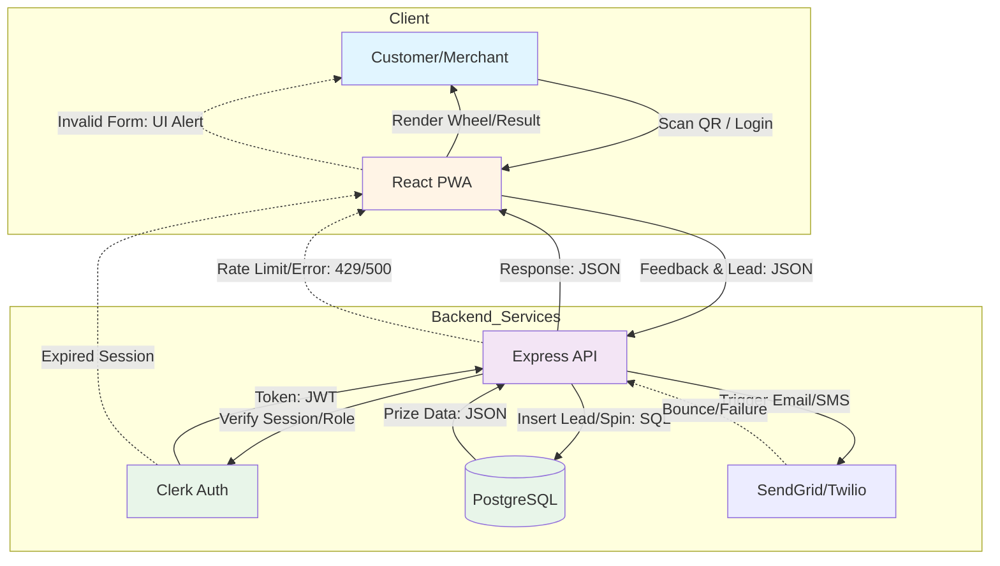
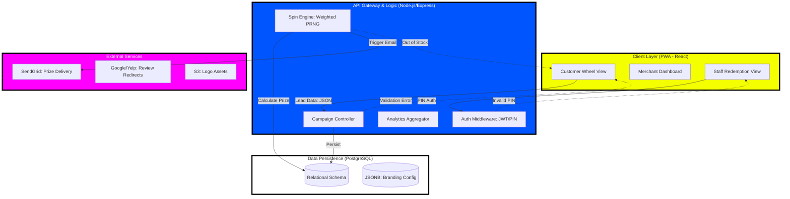

# System Architecture - SpinRate

> Technical architecture and system design

---

## Overview

# Technical Architecture Overview

## Complexity Assessment & Architectural Pattern

**Step 1 Analysis:**
- **Feature Count from Step 1:** 7 features (Branded Wheel, Non-Gated Feedback, Lead Capture, Prize Fulfillment, Review Routing, Merchant Dashboard, Automated Prize Email/SMS).
- **User Personas Identified:** 5 (Marco/Cafe Owner, Sarah/Agency Lead, Leo/Event Manager, Elena/Franchise Operator, David/Service Provider). High variety in management needs (single vs. multi-unit).
- **Real-time Features Found:** "Merchant Analytics Dashboard... updated in real-time" and "Delivery of prize voucher within 30 seconds."
- **Third-party Integrations Mentioned:** Google/Facebook/TripAdvisor (Review platforms), Twilio/SendGrid (Communication), and QR generation.
- **Authentication Complexity:** Role-based (Merchant Admin vs. Staff PIN-based redemption) and multi-tenant (Agency managing multiple clients).
- **Business Logic Complexity:** Multi-step compliance workflow (Feedback -> Optional Review -> Lead Capture -> Spin) with conditional prize weighting.

**Complexity Determination:**
- **Determined Complexity:** Medium Complexity
- **Justification:** While the core interaction is a simple wheel spin, the architecture must support multi-tenant agency roles, staff-level PIN security, and a specific multi-stage logic flow to maintain Google TOS compliance.
- **Recommended Pattern:** Monolithic MVP (Modular Monolith)
- **Pattern Justification:** A monolithic approach with a shared PostgreSQL database allows for rapid development of the lead-capture-to-spin flow and easier management of relational data (Merchants, Campaigns, Leads, Prizes) without the overhead of microservices.

## MVP Component Architecture

### Gamification & Feedback Engine (Frontend)
**Triggered by:** User scanning a QR code and landing on the PWA.
**Input Data:** Campaign ID (UUID), User Feedback (String/Integer), Lead Info (Email/Phone JSON).
**Output Data:** Spin Result (JSON), Prize ID (String), Interaction Logs (JSON).
**Failure Handling:** Local state persistence if the connection drops during feedback; graceful fallback to a "Thank You" screen if the wheel fails to load.
**Dependencies:** React-Canvas-Wheel component, Backend API.
**MVP Scope:** Handles the 3-step UI (Feedback -> Review Redirect -> Lead Form -> Spin).

### Campaign & Prize Manager (Backend)
**Triggered by:** Form submission or "Spin" request from the frontend.
**Input Data:** Campaign Configuration (JSON), Prize Weights (Array), Staff PIN (String).
**Output Data:** Validated Lead Record, Weighted Random Prize, Redemption Status (Boolean).
**Failure Handling:** Atomic database transactions to ensure a lead is saved before a prize is awarded; 429 rate limiting to prevent "spin-spamming."
**Dependencies:** PostgreSQL, Auth Service.
**MVP Scope:** Manages prize inventory, validates staff PINs, and executes the non-gated logic flow.

### Merchant Analytics & Configuration Portal
**Triggered by:** Merchant/Agency logging into the dashboard.
**Input Data:** Merchant ID (UUID), Date Range (ISO String), Wheel Config (JSON).
**Output Data:** Aggregated Scan/Spin Stats (JSON), Lead CSV Export, Active Campaign Settings.
**Failure Handling:** Cached query results for the dashboard to prevent slow loads; standard 401/403 handling for unauthorized access.
**Dependencies:** SQL Aggregation functions, Frontend Charting library.
**MVP Scope:** Basic CRUD for wheel settings and a summary table of leads and conversion rates.

## Technology Stack Recommendations

### Frontend: React (PWA)
**Capability Requirement:** Responsive, mobile-first interaction for physical locations.
**Implementation Constraint:** Must work on iOS Safari/Android Chrome without App Store installs.
**Alternative Considered:** Flutter Web (Rejected due to larger bundle sizes and slower initial load on 4G).
**MVP Justification:** React’s ecosystem provides mature canvas and form libraries for rapid UI development.

### Backend: Node.js (Express)
**Capability Requirement:** Fast I/O for handling high-concurrency scans at events.
**Implementation Constraint:** Needs to handle JSON-heavy configuration and API redirects.
**Alternative Considered:** Python/Django (Rejected due to slower development speed for real-time JSON-based APIs).
**MVP Justification:** Single language (JS/TS) across the stack speeds up development and deployment.

### Database: PostgreSQL
**Capability Requirement:** Relational integrity for linking Leads to specific Campaigns and Merchants.
**Implementation Constraint:** Must support complex aggregations for the Merchant Dashboard.
**Alternative Considered:** MongoDB (Rejected; relational prize/lead tracking is more reliable in SQL).
**MVP Justification:** Robust, scales well, and handles the multi-tenant structure (Agencies -> Merchants -> Campaigns) natively.

### Hosting/Deployment: Vercel (Frontend) & Railway (Backend)
**Capability Requirement:** Zero-config deployment with automatic SSL.
**Implementation Constraint:** Needs to support environment variables for API keys (SendGrid/Twilio).
**Alternative Considered:** AWS (Rejected; too much configuration overhead for a Phase 1 prototype).
**MVP Justification:** Provides the fastest path from "code" to "live URL" with built-in CI/CD.

### Authentication: Clerk
**Capability Requirement:** Secure Merchant login and multi-tenant role management.
**Implementation Constraint:** Reduces the risk of handling sensitive user passwords.
**Alternative Considered:** Custom JWT (Rejected; too time-consuming to build secure password reset/Oauth).
**MVP Justification:** Handles user management out-of-the-box, allowing focus on the gamification logic.

## Core Integration Points

### Integration 1: Google/External Review Platforms
**Required Endpoints:** Client-side redirect to `https://search.google.com/local/writereview?placeid=[ID]`
**Data Transformation:** Dynamic URL construction based on Merchant profile settings.
**Authentication:** None (Public redirect).
**Error Handling:** Fallback to the Merchant’s website if the Place ID is missing.
**MVP Scope:** Simple button-click redirect after the feedback step.

### Integration 2: SendGrid / Postmark (Email)
**Required Endpoints:** `POST /v3/mail/send`
**Data Transformation:** Mapping Prize ID and Merchant Name into a "Winner" email template.
**Authentication:** API Key (Bearer Token).
**Error Handling:** Webhook monitoring to track delivery failures; retry logic for 5xx errors.
**MVP Scope:** Triggered only upon "Spin Complete" to deliver the prize voucher.

### Integration 3: QR Code Generator (Library/API)
**Required Endpoints:** Local library generation (e.g., `qrcode.react`)
**Data Transformation:** Encode Campaign URL with unique Merchant UUID parameters.
**Authentication:** None.
**Error Handling:** Ensure high error correction level (Level H) for scan reliability in low light.
**MVP Scope:** Static QR code generation in the Merchant Dashboard for printing.

## System Architecture Diagram



## Data Flow Architecture

### Primary User Flow Data Movement
1. **User Input → Frontend:** User enters email/phone (String) and star rating (Int).
2. **Frontend → Backend:** POST request with payload `{campaignId, email, feedback, rating}` + JWT.
3. **Backend → Database:** `INSERT INTO leads` and `SELECT prize FROM inventory WHERE weight...`.
4. **Database → Backend:** Returns `lead_id` and `prize_details` (JSON).
5. **Backend → Frontend:** Returns `201 Created` with the specific prize slice index for the wheel.
6. **Frontend → User:** Wheel spins to the determined index; "Winner" modal appears.

### Error Handling Data Flow
1. **Validation Errors:** Backend returns `400 Bad Request` with field-specific messages; Frontend highlights input borders.
2. **Server Errors:** `500 Internal Server Error` triggers a "Try again" toast on the UI.
3. **Network Errors:** PWA uses service workers to detect offline status and disables the "Spin" button.
4. **Authentication Errors:** `401 Unauthorized` redirects Merchants back to the Clerk login page.

## MVP Implementation Priorities

### Phase 1 (Immediate MVP) - Build These First
- [ ] **Non-Gated Logic Flow** - Ensures compliance and core value proposition.
- [ ] **React Canvas Wheel** - The primary "hook" for user engagement.
- [ ] **Lead Capture Form** - Critical for the "data capture" business goal.
- [ ] **Basic Merchant Dashboard** - Allows users to see the leads they are paying for.
- [ ] **PIN-based Redemption** - Prevents prize fraud at the physical location.

### Phase 2 (Enhancement) - Build After MVP Works
- [ ] **Multi-unit Reporting** - Necessary for franchise operators (Elena).
- [ ] **Automated SMS Reminders** - For prizes not claimed within 24 hours.
- [ ] **Custom Domain Support** - For white-label agency needs.

### Not in MVP Scope
- [ ] **A/B Testing** - Deferred until baseline conversion data is established.
- [ ] **Deep CRM Sync** - Use CSV exports for Phase 1 to save development time.

## Technical Risk Assessment

### High-Risk Areas Requiring Early Validation
1. **Google TOS Compliance:** Risk of being flagged if the "Review" link is too prominent. *Mitigation:* Ensure the "Spin" is equally accessible to 1-star and 5-star feedback.
2. **QR Scan Reliability:** Low-quality cameras or poor lighting. *Mitigation:* Use high-contrast QR codes and test on older devices (iPhone 8/Android 10).
3. **Prize Fraud:** Users clearing cookies to spin multiple times. *Mitigation:* Unique email/phone validation in the database per campaign.

### External Dependencies & Fallback Plans
1. **SendGrid/Postmark:** If email fails, the prize is still displayed on the "Result" screen for immediate redemption.
2. **Clerk Auth:** If auth is down, implement a "Emergency Access" mode using hardcoded environment variables for critical merchant edits.

## Development Environment Setup

### Required Development Tools
- **Node.js v18+**: For backend runtime.
- **PostgreSQL 14**: Local database for development.
- **Tailwind CSS**: For rapid, mobile-responsive UI styling.

### MVP Deployment Strategy
**Hosting:** Vercel (Frontend) and Railway (Backend/DB) for the fastest deployment cycle.
**CI/CD:** GitHub Actions to run linting and auto-deploy to Vercel/Railway on `main` branch push.
**Monitoring:** Sentry (Free Tier) for error tracking and basic Google Analytics for scan-to-lead funnel tracking.

---

## Technical Specifications

# STEP 6: AI-OPTIMIZED TECHNICAL SPECIFICATIONS

## 1. Executive Summary & System Architecture

Your App is a high-performance, PWA-based gamification engine designed to bridge the gap between physical foot traffic and digital engagement. The architecture prioritizes low-latency wheel interactions and robust lead capture using a "Feedback-First, Non-Gated" logic to ensure Google TOS compliance.

### 1.1 High-Level System Architecture


---

## 2. Machine-Readable System Architecture

| Component | Technology | Responsibility | Scaling Strategy |
| :--- | :--- | :--- | :--- |
| **Frontend PWA** | React 18, Vite, Tailwind | Neo-Brutalist UI, Canvas-based wheel, Offline lead caching. | Edge Deployment (Vercel/Netlify) |
| **Backend API** | Node.js (TypeScript), Express | Business logic, prize weight calculation, Auth. | Horizontal Pod Autoscaling (K8s/ECS) |
| **Database** | PostgreSQL 15 | Persistent storage for leads, campaigns, and redemptions. | Read Replicas for Analytics |
| **Cache/Queue** | Redis | Rate limiting, spin locking, email queueing. | Managed Cluster |
| **File Storage** | AWS S3 | Merchant logos and QR code assets. | CDN Distribution (CloudFront) |

---

## 3. Feature Implementation Specifications

### 3.1 Non-Gated Spin Engine (Core Logic)
The system must decouple the "Feedback" action from the "Spin" action. 
- **Logic:** `POST /interact` accepts feedback stars (1-5). The server records the feedback but returns a `spin_token` regardless of the rating.
- **Error Handling:** If a user attempts to spin without a valid `lead_id`, return `403 Forbidden` with a recovery strategy to redirect to the lead form.

### 3.2 Prize Calculation Algorithm
```typescript
/**

*[Content truncated - see full PRD for details]*

---


*See [PRD.md](../PRD.md) for complete technical specifications*
